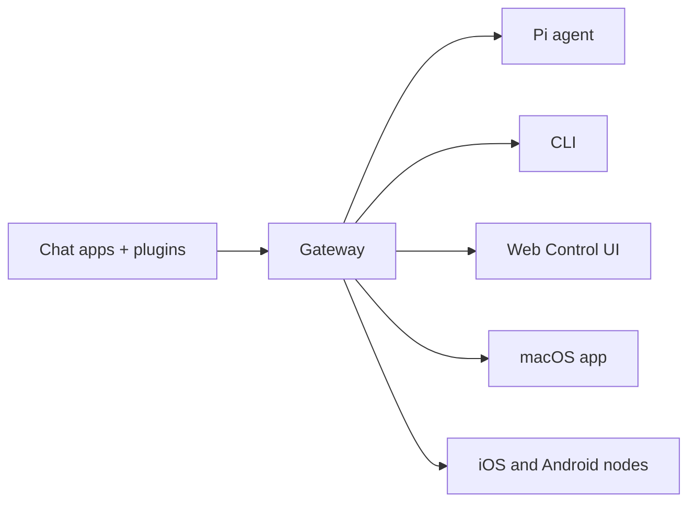

# Kolb-Bot 🏴‍☠️

<p align="center">
    
    
</p>

<p align="center">
    
</p>

<p align="center">
    
</p>

> _Half human. Half AI. All pirate._

<p align="center">
  <strong>AI made simple. Kolb-Bot explains every step in plain language so anyone can use advanced AI — not just developers.</strong><br />
  Message your assistant on WhatsApp, Telegram, Discord, iMessage, and more. No PhD required.
</p>

<Columns>
  <Card title="Get Started" href="/start/getting-started" icon="rocket">
    Install Kolb-Bot and bring up the Gateway in minutes.
  </Card>
  <Card title="Run the Wizard" href="/start/wizard" icon="sparkles">
    Guided setup with `kolb-bot onboard` and pairing flows.
  </Card>
  <Card title="Open the Control UI" href="/web/control-ui" icon="layout-dashboard">
    Launch the browser dashboard for chat, config, and sessions.
  </Card>
</Columns>

## What is Kolb-Bot?

Kolb-Bot is a **personal AI assistant** that connects to the messaging apps you already use — WhatsApp, Telegram, Discord, iMessage, and more. It runs on your own machine, so your data stays yours.

**Who is it for?** Anyone who wants a smart AI assistant they can message from anywhere. You don't need to be a developer. Kolb-Bot was built because most people only know how to use basic chat models — and the powerful stuff (agents, tools, automations) was too complicated. Kolb-Bot explains everything in simple language.

**What makes it different?**

- **Beginner-friendly**: every step is explained in plain language, not developer jargon
- **Self-hosted**: runs on your hardware, your data stays private
- **Multi-channel**: message your assistant on WhatsApp, Telegram, Discord, and more — all at once
- **Powerful under the hood**: agents, tools, memory, voice, and automations — all accessible
- **Open source**: MIT licensed, community-driven

**What do you need?** Node 22+, an API key from your chosen provider, and 5 minutes. The setup wizard walks you through everything.

## How it works



The Gateway is the single source of truth for sessions, routing, and channel connections.

## Key capabilities

<Columns>
  <Card title="Multi-channel gateway" icon="network">
    WhatsApp, Telegram, Discord, and iMessage with a single Gateway process.
  </Card>
  <Card title="Plugin channels" icon="plug">
    Add Mattermost and more with extension packages.
  </Card>
  <Card title="Multi-agent routing" icon="route">
    Isolated sessions per agent, workspace, or sender.
  </Card>
  <Card title="Media support" icon="image">
    Send and receive images, audio, and documents.
  </Card>
  <Card title="Web Control UI" icon="monitor">
    Browser dashboard for chat, config, sessions, and nodes.
  </Card>
  <Card title="Mobile nodes" icon="smartphone">
    Pair iOS and Android nodes for Canvas, camera, and voice-enabled workflows.
  </Card>
</Columns>

## Quick start

<Steps>
  <Step title="Install Kolb-Bot">
    ```bash
    npm install -g kolb-bot@latest
    ```
  </Step>
  <Step title="Onboard and install the service">
    ```bash
    kolb-bot onboard --install-daemon
    ```
  </Step>
  <Step title="Pair WhatsApp and start the Gateway">
    ```bash
    kolb-bot channels login
    kolb-bot gateway --port 18789
    ```
  </Step>
</Steps>

Need the full install and dev setup? See [Quick start](/start/quickstart).

## Dashboard

Open the browser Control UI after the Gateway starts.

- Local default: [http://127.0.0.1:18789/](http://127.0.0.1:18789/)
- Remote access: [Web surfaces](/web) and [Tailscale](/gateway/tailscale)

<p align="center">
  
</p>

## Configuration (optional)

Config lives at `~/.kolbick/Kolb-Bot-Beta-.json`.

- If you **do nothing**, Kolb-Bot uses the bundled Pi binary in RPC mode with per-sender sessions.
- If you want to lock it down, start with `channels.whatsapp.allowFrom` and (for groups) mention rules.

Example:

```json5
{
  channels: {
    whatsapp: {
      allowFrom: ["+15555550123"],
      groups: { "*": { requireMention: true } },
    },
  },
  messages: { groupChat: { mentionPatterns: ["@kolb-bot"] } },
}
```

## Start here

<Columns>
  <Card title="Docs hubs" href="/start/hubs" icon="book-open">
    All docs and guides, organized by use case.
  </Card>
  <Card title="Configuration" href="/gateway/configuration" icon="settings">
    Core Gateway settings, tokens, and provider config.
  </Card>
  <Card title="Remote access" href="/gateway/remote" icon="globe">
    SSH and tailnet access patterns.
  </Card>
  <Card title="Channels" href="/channels/telegram" icon="message-square">
    Channel-specific setup for WhatsApp, Telegram, Discord, and more.
  </Card>
  <Card title="Nodes" href="/nodes" icon="smartphone">
    iOS and Android nodes with pairing, Canvas, camera, and device actions.
  </Card>
  <Card title="Help" href="/help" icon="life-buoy">
    Common fixes and troubleshooting entry point.
  </Card>
</Columns>

## Learn more

<Columns>
  <Card title="Full feature list" href="/concepts/features" icon="list">
    Complete channel, routing, and media capabilities.
  </Card>
  <Card title="Multi-agent routing" href="/concepts/multi-agent" icon="route">
    Workspace isolation and per-agent sessions.
  </Card>
  <Card title="Security" href="/gateway/security" icon="shield">
    Tokens, allowlists, and safety controls.
  </Card>
  <Card title="Troubleshooting" href="/gateway/troubleshooting" icon="wrench">
    Gateway diagnostics and common errors.
  </Card>
  <Card title="About and credits" href="/reference/credits" icon="info">
    Project origins, contributors, and license.
  </Card>
</Columns>
